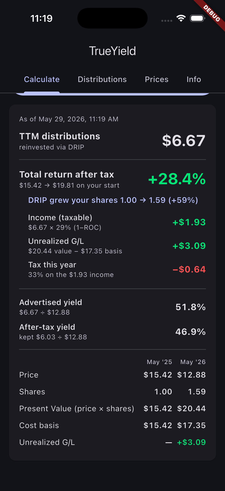
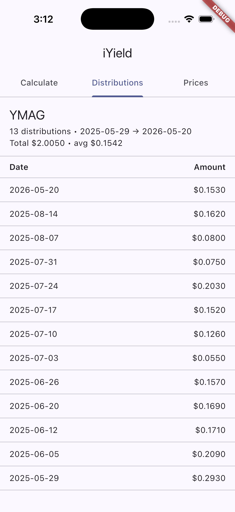
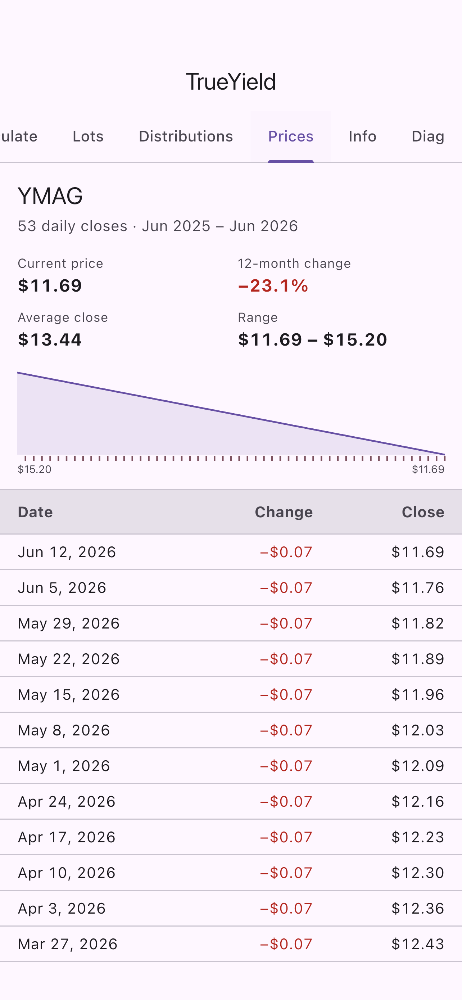

<p align="center">
  
</p>

# TrueYield

[](https://github.com/jimzucker/TrueYield/actions/workflows/ci.yml)
[](https://jimzucker.github.io/TrueYield/)
[](./LICENSE)

**Know what a dividend stock or ETF actually pays you — after taxes, and after the share price moves.**

▶ **Try it live in your browser:** [jimzucker.github.io/TrueYield](https://jimzucker.github.io/TrueYield/) — no install required.

TrueYield is a mobile app that takes a ticker and your marginal tax rates and answers one question honestly: *for the last 12 months, what was my real yield?* A headline yield of "15%" can quietly become single digits once you account for the price you'd actually reinvest at, the taxes you'd actually owe, and the change in the share price itself. TrueYield shows you all of it, side by side, in one screen.

## Screenshots

<table>
<tr>
<td width="33%" align="center"><b>Calculate</b><br/><sub>Total return after tax, then the full breakdown</sub></td>
<td width="33%" align="center"><b>Distributions</b><br/><sub>Every payout in the trailing 12 months</sub></td>
<td width="33%" align="center"><b>Prices</b><br/><sub>Daily closes behind the math</sub></td>
</tr>
<tr>
<td></td>
<td></td>
<td></td>
</tr>
</table>

## Why TrueYield

The "yield" number you see on most finance sites is the simplest possible calculation: trailing distributions divided by today's price. It's a useful headline, but it hides three things that decide whether an investment actually paid off:

- **Reinvestment price.** If you reinvest each distribution (DRIP), you buy at the price *on the day it was paid* — not today's price. For volatile high-yield ETFs, that materially changes your effective yield.
- **Taxes.** Distributions are income. Your real take-home depends on your federal, state, and local marginal rates.
- **The share price.** A 15% yield means little if the share price fell 16% over the same year. Income and price change together are your **total return** — often the only number that matters.

TrueYield simulates a full year of **broker DRIP** reinvestment, taxes only the portion of distributions that is actually taxable income (accounting for **return of capital**), and reports your **total return after tax** alongside the advertised and after-tax yields — so you can see how much the headline number leaves out.

## How to use it

1. **Enter a ticker** (e.g. `YMAG`, `SCHD`, `JEPI`).
2. **Return of capital %** — auto-fills for the tracked funds (see [Bundled ROC data](#bundled-roc-data)); edit it if you disagree, or set it by hand for funds we don't track.
3. **Enter your marginal tax rates** — federal, state, and local, as whole percentages (local defaults to `0`).
4. *(Optional)* **Add lots** on the form — real buy dates with a share count and/or cost. Give a lot a sell date and it books a realized gain; leave it blank to hold to today. No lots means "one share bought a year ago."
5. **Tap Calculate.**

The result card leads with **Total return after tax** — your income plus the change in share price, net of this year's tax, measured against what one share cost a year ago. Directly beneath it are the components that sum to it: **income (taxable)**, **realized / unrealized gain/loss**, and **tax this year**. Then two yields on today's price: the **Advertised yield** (the headline) and the **After-tax yield**. A "show your work" grid shows the position economics underneath — a reference grid for the default share, or a per-lot portfolio table when you've entered lots.

The app has six tabs: **Calculate**, **Lots** (full per-lot detail), **Distributions** (every payout split into return-of-capital vs taxable, with an editable per-row ROC %), **Prices** (the daily closes behind the math), **Info** (this guide + the tracked-fund list + CSV downloads), and **Diagnostics** (self-test scenarios). Your inputs and lots are saved locally per ticker, so they're already filled in next time.

If a ticker paid no distributions in the last 12 months, it's flagged **"Does not qualify"** and the card shows just the current price.

## How the numbers work

TrueYield models one share bought ~12 months ago at `start_price`, with every distribution reinvested through a **broker DRIP** at the share price on its pay date. Only the taxable portion of distributions — `income = total × (1 − ROC%)` — is taxed this year at your combined marginal rate; the return-of-capital portion isn't taxed now but lowers your cost basis. The headline figures:

| Figure | What it means | How it's calculated |
|---|---|---|
| **Advertised yield** | The headline number most sites quote. | `total distributions / current_price` |
| **After-tax yield** | What you actually keep, after this year's tax. | `(total distributions − tax) / current_price` |
| **Total return after tax** | The bottom line: income *and* price change, net of tax, on your original cost. | `(NAV − tax − start_price) / start_price` |

…where `NAV = shares_after_DRIP × current_price` and `tax = combined_rate × taxable income`. The card also surfaces the **cost basis** (`start_price + reinvested income`) and the resulting **unrealized gain/loss** (`NAV − cost basis`), which is taxed as capital gains only when you sell.

## Bundled ROC data

Return of capital isn't in the Yahoo feed — the only authoritative source is each issuer's **Section 19a-1 notices** (per-distribution estimates) and year-end **Form 8937 / 1099** (actuals). TrueYield bundles a return-of-capital history for **40+ tracked funds** (YieldMax, NEOS, Global X, ProShares, iShares, REX, Roundhill, Amplify, First Trust, Invesco, and more), scraped from those documents by the tools in [`tools/`](./tools) and compiled into the app. When you enter a tracked ticker, each distribution's ROC % auto-fills with the right value — and for a **completed calendar year** it uses the settled annual figure (YieldMax Form 8937 actuals, or the year's aggregate) rather than the weekly estimates. You can always override any row.

A [GitHub Action](./.github/workflows/refresh-roc.yml) refreshes the prices, ROC notices, and 8937 actuals every weekday and commits any changes, so the data stays current without manual work. The full history is downloadable as CSV from the foot of the Distributions and Prices tabs (and the Info tab lists every tracked fund). ROC figures are estimates/issuer characterizations, not tax advice — see your 1099.

## Data and privacy

TrueYield runs entirely on your device. There is no account, no API key, and no backend server. When you tap Calculate, it makes a single HTTPS request to Yahoo Finance's public chart endpoint to fetch the **daily** prices and distributions for your ticker — nothing else leaves your device, and nothing is logged or transmitted anywhere else. The return-of-capital history is compiled into the app, so it needs no network call. The CSV-download and project links open files hosted on GitHub only when you tap them.

See [PRIVACY.md](./PRIVACY.md) for the full policy.

## Important notes

- **Not investment advice.** TrueYield is an analysis tool. The numbers are historical (trailing 12 months) and are not a forecast.
- **US tax model.** Calculations apply a single combined marginal rate (federal + state + local) to the **taxable** portion of distributions. The return-of-capital portion is treated as a cost-basis reduction (its tax is deferred to sale as capital gains), not taxed in-year. Qualified-dividend rates are not modeled — set the rates to match your situation.
- **Daily resolution.** Prices and the DRIP reinvestment use daily closes over a one-year window, so weekly and monthly payers are both handled without bucketing.
- **Unofficial data source.** Data comes from Yahoo Finance's public, unofficial endpoint, which can change or rate-limit without notice. TrueYield is not affiliated with Yahoo.

## Running it

TrueYield is a [Flutter](https://flutter.dev) app and runs on iOS and Android (the project also includes desktop and web targets). To build and run from source:

```sh
flutter pub get
flutter run -d <device-id>
```

Dependencies are deliberately minimal: `http` for the single network call and `shared_preferences` for saving your inputs. No state-management library — plain `setState`.

## Development

The calculation logic lives in a pure, dependency-free `YieldMath` class (no Flutter, no network, no clock), which makes it straightforward to test. Three checks — formatting, static analysis, and the test suite — run in three places, all kept in sync:

```sh
dart format --output=none --set-exit-if-changed .
flutter analyze
flutter test
```

- **CI** — [`.github/workflows/ci.yml`](./.github/workflows/ci.yml) runs all three on every push to `main` and every pull request.
- **Pre-commit hook** — enable once per checkout so `git commit` runs the same gate locally:

  ```sh
  git config core.hooksPath .githooks
  ```

The Dart test suite covers the broker-DRIP / return-of-capital math (flat-price baseline, the ROC income split, lot aggregation and realized gains, price-drop and price-rise total return, and daily-bar fixtures verified against the Python reference in [`tools/yield_ref.py`](./tools/yield_ref.py)), the Yahoo response parser and its ROC-precedence rules (user override > completed-year actual > per-distribution history > default), the Diagnostics self-test scenarios, and the app's six-tab rendering, input validation, and saved-input restoration. CI additionally runs [`tools/test_parsers.py`](./tools/test_parsers.py) — fixture tests for the format-fragile scraper/parser internals (notice and Form 8937 parsing, the year aggregates).

See [SESSION_LOG.md](./SESSION_LOG.md) for the project's iteration history.

## License

Copyright 2026 James A. Zucker. Licensed under the Apache License, Version 2.0 — see [LICENSE](./LICENSE) and [NOTICE](./NOTICE).

> "TrueYield" is a personal project name and is not affiliated with Yahoo, Yahoo Finance, any brokerage, or any of the issuers whose tickers it queries. Yahoo and Yahoo Finance are trademarks of their respective owners.
